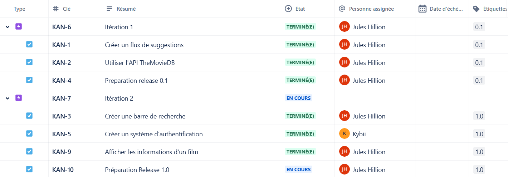
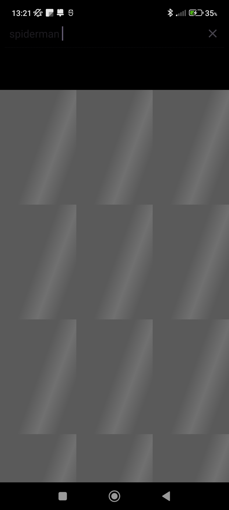
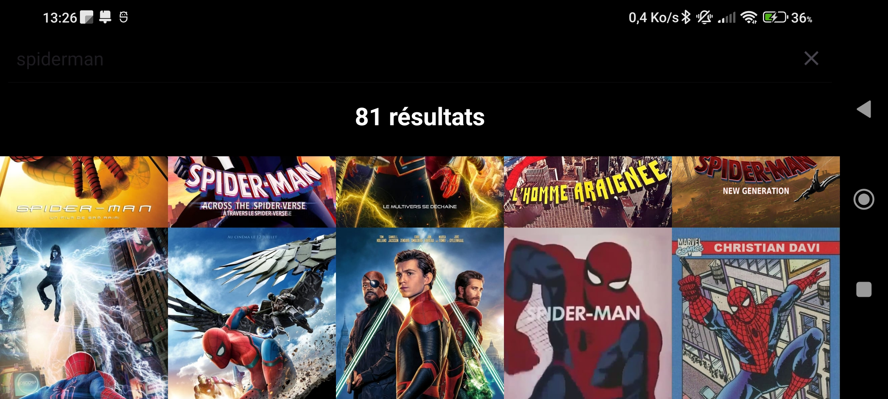

# Le projet MViewer 2024

- [Le projet MViewer 2024](#le-projet-mviewer-2024)
  - [Présentation](#présentation)
  - [Itérations](#itérations)
    - [Itération 1](#itération-1)
    - [Itération 2](#itération-2)
    - [Itération 3](#itération-3)
  - [Tickets Jira](#tickets-jira)
  - [Diagramme de cas d'utilisation](#diagramme-de-cas-dutilisation)
  - [Diagramme de classes](#diagramme-de-classes)
  - [Screenshots](#screenshots)
    - [Page de connexion](#page-de-connexion)
    - [Page de création de compte](#page-de-création-de-compte)
    - [Flux de films populaires](#flux-de-films-populaires)
    - [Recherche de films (Chargement à vide)](#recherche-de-films-chargement-à-vide)
    - [Recherche de films](#recherche-de-films)
    - [Recherche de films (Chargement de plus de résultats)](#recherche-de-films-chargement-de-plus-de-résultats)
    - [Recherche de films (Paysage)](#recherche-de-films-paysage)
    - [Informations sur le film](#informations-sur-le-film)
  - [Recette](#recette)
  - [Auteurs](#auteurs)

---

## Présentation

**MViewer** est une application mobile Android qui permet de visualiser les films populaires du moment ou d'en rechercher pour en obtenir des informations spécifiques.

## Itérations

### Itération 1
- Visualiser les plaquettes des films populaires.
- Naviguer entre les différentes plaquettes.
- Créer un design intuitif et agréable.
- Intégrer une API de films et séries.

### Itération 2
- Ajouter des fonctionnalités de recherche.
- Afficher plus d'informations détaillées lors d'un clic sur un film.
- Permettre à l'utilisateur de se connecter.

### Itération 3
- Ajouter une base de données pour gérer les comptes utilisateurs.
- Permettre à l'utilisateur de paramétrer l'application selon ses préférences.

## Tickets Jira

## Diagramme de cas d'utilisation

## Diagramme de classes

## Screenshots

### Page de connexion

### Page de création de compte

### Flux de films populaires

### Recherche de films (Chargement à vide)

### Recherche de films

### Recherche de films (Chargement de plus de résultats)

### Recherche de films (Paysage)

### Informations sur le film

## Recette

| Fonctionalités                              | Oui | Non |
|---------------------------------------------|:---:|:---:|
| Visualiser les plaquettes                   |  X  |     |
| Naviguer entre les plaquettes               |  X  |     |
| Créer un design intuitif                    |  X  |     |
| Utiliser l'API TheMovieDB                   |  X  |     |
| Rechercher des films                        |  X  |     |
| Afficher des information sur un film        |  X  |     |
| Permettre à l'utilisateur de se connecter   |  X  |     |
| Créer une base de données                   |     |  X  |
| Paramétrer l'application                    |     |  X  |

## Auteurs

- Étudiant B3 IA : RAGIN Léo <<leo.raguin@gmail.com>>
- Étudiant B3 IA : HILLION Jules <<juleshillion@gmail.com>>

---
©️ ESAIP Saint-Barthélemy-d'Anjou - 2024